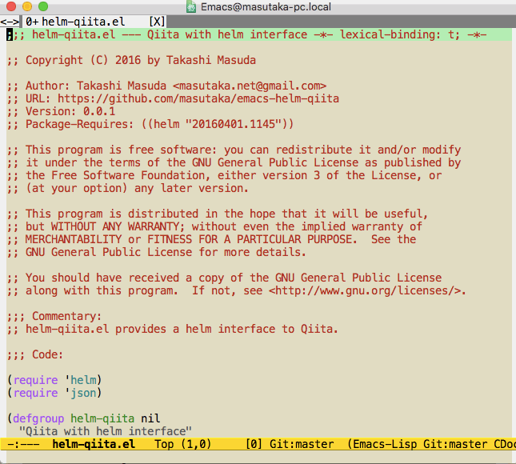

# helm-qiita.el [![melpa badge][melpa-badge]][melpa-link] [![melpa stable badge][melpa-stable-badge]][melpa-stable-link]

## Introduction

`helm-qiita.el` is a helm interface for [Qiita](https://qiita.com/).

You can open your Qiita Stocks to Web browser using helm interface.

Also supports [Qiita:Team](https://teams.qiita.com/).

## Screenshot



## Requirements

* Emacs 24.5 or higher
* helm 1.9.5 or higher
* curl

## Installation

You can install `helm-qiita.el` from [MELPA](https://melpa.org) with package.el (`M-x package-install helm-qiita`).

## Setup

```lisp
(setq helm-qiita-username "Your Qiita Account")
(setq helm-qiita-organization "Your Organization") ;; optional. For example, "feedforce"
(setq helm-qiita-access-token "Your Access Token") ;; See https://qiita.com/settings/applications
(helm-qiita-initialize)
```

Requires scopes `read_qiita` or `read_qiita_team` for `helm-qiita-access-token`.

## Usage

### `helm-qiita`

* A function to be able to select your Qiita Stocks.

### `helm-qiita-source`

* A helm source for your Qiita Stocks.

[melpa-link]: https://melpa.org/#/helm-qiita
[melpa-stable-link]: https://stable.melpa.org/#/helm-qiita
[melpa-badge]: https://melpa.org/packages/helm-qiita-badge.svg
[melpa-stable-badge]: https://stable.melpa.org/packages/helm-qiita-badge.svg
